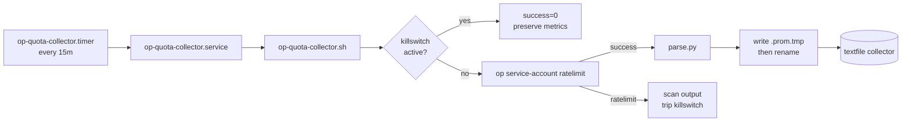

# Design Document

## Overview

Ansible role `op_quota_collector` deployed to command-center1 via `playbooks/cmd_center.yml`. The role installs:

- A shell collector (`op-quota-collector.sh`) that orchestrates a single quota read.
- A Python helper (`parse.py`) that converts the `op service-account ratelimit` table into Prometheus textfile format.
- A systemd oneshot service and a 15-minute timer that fires the collector.

Everything writes to the existing `/var/lib/node_exporter/textfiles/` directory already scraped by node_exporter, so no new Prometheus scrape config is needed.

## Steering Document Alignment

### Technical Standards (tech.md)

- Shell script uses the same `set -uo pipefail` idiom and `logger -t` tagging as the other collectors in this repo (`scripts/run-proxmox.sh`, `scripts/run-security.sh`).
- Sources the shared kill-switch library from `scripts/lib/op-killswitch.sh` so all `op` consumers respect the same rate-limit protections.
- systemd unit structure mirrors `roles/k8s_maintenance/templates/etcd-defrag.{service,timer}.j2`.

### Project Structure (structure.md)

Role path matches existing convention: `roles/<name>/{tasks,templates,files,defaults}/`. Parser fixtures live under `roles/op_quota_collector/tests/fixtures/`.

## Code Reuse Analysis

### Existing Components to Leverage

- **`scripts/lib/op-killswitch.sh`**: The collector sources this for `op_killswitch_check_or_exit` (guard at top) and `op_killswitch_scan_file` (after an op failure). Zero new kill-switch logic.
- **`OP_SERVICE_ACCOUNT_TOKEN` read-only token at `~/.config/op/service-account-token`**: The same token used by `vault-pass.sh` and the other wrappers. `op service-account ratelimit` only needs read scope.
- **node_exporter textfile directory `/var/lib/node_exporter/textfiles/`**: Already created with the correct sticky-bit + ladino ownership by the monitoring role in this repo. Reused as-is.
- **systemd user pattern**: Same shape as `etcd-defrag.timer`, `update-metrics.timer` (unattended_upgrades).

### Integration Points

- **k8s-argocd alert rules** reference the metric names this role emits. The spec in that repo (`.spec-workflow/specs/1password-quota-monitoring`) owns the alert side; this role owns the metric side.
- **Kill switch state at `/var/lib/ansible-quasarlab/1p-killswitch`** is read (and potentially written) by the collector.

## Architecture



### Modular Design Principles

- **Shell script**: ~100 lines. Single responsibility: run the op call, invoke the parser, write the metric file, handle errors.
- **Parser**: ~60 lines Python. Single responsibility: table in, Prometheus text out. Testable in isolation.
- **Systemd units**: separate service (what to run) from timer (when to run). Idiomatic.
- **Ansible tasks**: one file, ~40 lines, linear. Deploy files, reload-on-change handler, enable timer.

## Components and Interfaces

### `files/parse.py`

- **Purpose**: Convert the `op service-account ratelimit` table to Prometheus textfile format.
- **Invocation**: `parse.py < op_output.txt > /path/to/textfile.prom`
- **Inputs (stdin)**: the literal stdout of `op service-account ratelimit`, e.g.:
  ```
  TYPE       ACTION        LIMIT    USED    REMAINING    RESET
  token      write         100      0       100          N/A
  token      read          1000     0       1000         N/A
  account    read_write    1000     42      958          23 hours and 12 minutes from now
  ```
- **Outputs (stdout)**: Prometheus text format. Example:
  ```
  # HELP onepassword_ratelimit_used Requests used in the current window.
  # TYPE onepassword_ratelimit_used gauge
  onepassword_ratelimit_used{type="token",action="write"} 0
  onepassword_ratelimit_used{type="token",action="read"} 0
  onepassword_ratelimit_used{type="account",action="read_write"} 42
  # HELP onepassword_ratelimit_limit Request limit for this window.
  # TYPE onepassword_ratelimit_limit gauge
  onepassword_ratelimit_limit{type="token",action="write"} 100
  ...
  # HELP onepassword_ratelimit_reset_seconds Seconds until the limit resets (absent if N/A).
  # TYPE onepassword_ratelimit_reset_seconds gauge
  onepassword_ratelimit_reset_seconds{type="account",action="read_write"} 83520
  ```
- **Errors**: Malformed input exits 2 with `error: <reason>` on stderr, no stdout. Missing columns, extra columns, or wrong header are treated as malformed.
- **Dependencies**: Python 3 stdlib only (`re`, `sys`).

### `templates/op-quota-collector.sh.j2`

- **Purpose**: Orchestrate one quota-measurement cycle.
- **Invocation**: `/usr/local/bin/op-quota-collector.sh` (no CLI args).
- **Behavior**:
  1. Load env (including `OP_SERVICE_ACCOUNT_TOKEN`).
  2. Source `/home/ladino/code/ansible-quasarlab/scripts/lib/op-killswitch.sh`.
  3. If killswitch active: write `success=0` keeping prior body; log `reason=killswitch`; exit 0.
  4. Else: run `op service-account ratelimit` into a temp file.
  5. On op failure: `op_killswitch_scan_file` the stderr; log `reason=ratelimited` or `reason=op_error`; write `success=0`; exit 0.
  6. On op success: pipe stdout through `parse.py` to `.prom.tmp`; append `collector_success 1` and `collector_timestamp_seconds $(date +%s)`; atomic rename to `.prom`; log `reason=success`; exit 0.
- **Key template variables**: metric file path, textfile dir, kill-switch lib path. All come from role defaults.
- **Error exit code policy**: always 0. The systemd service stays green; failure is a metric.

### `templates/op-quota-collector.service.j2`

- `Type=oneshot`
- `User={{ op_quota_user }}` (default `ladino`)
- `ExecStart=/usr/local/bin/op-quota-collector.sh`
- `Nice=10`, `IOSchedulingClass=best-effort`
- No restart policy (timer fires again anyway).

### `templates/op-quota-collector.timer.j2`

- `OnCalendar={{ op_quota_schedule }}` (default `*:0/15` = every 15 min on the quarter hour)
- `Persistent=true` so a missed fire runs at next boot.
- `AccuracySec=30s`.

### `tasks/main.yml`

```yaml
- name: Install parser helper
  ansible.builtin.copy:
    src: parse.py
    dest: /usr/local/lib/op-quota-collector/parse.py
    mode: '0755'
  notify: Restart op-quota-collector

- name: Install collector script
  ansible.builtin.template:
    src: op-quota-collector.sh.j2
    dest: /usr/local/bin/op-quota-collector.sh
    mode: '0755'
  notify: Restart op-quota-collector

- name: Install systemd service + timer
  ansible.builtin.template:
    src: "{{ item }}.j2"
    dest: "/etc/systemd/system/{{ item }}"
    mode: '0644'
  loop:
    - op-quota-collector.service
    - op-quota-collector.timer
  notify: Reload systemd

- name: Enable and start timer
  ansible.builtin.systemd:
    name: op-quota-collector.timer
    enabled: true
    state: started
    daemon_reload: true

- name: Prime first run so metrics exist before next scrape
  ansible.builtin.command: /usr/local/bin/op-quota-collector.sh
  changed_when: false
  become_user: "{{ op_quota_user }}"
  become: true
```

### `defaults/main.yml`

```yaml
op_quota_user: ladino
op_quota_schedule: "*:0/15"
op_quota_metric_file: /var/lib/node_exporter/textfiles/op_quota.prom
op_quota_parser: /usr/local/lib/op-quota-collector/parse.py
op_quota_killswitch_lib: /home/ladino/code/ansible-quasarlab/scripts/lib/op-killswitch.sh
```

## Data Models

### Metric file (`/var/lib/node_exporter/textfiles/op_quota.prom`)

Exactly the Prometheus textfile output described under `parse.py` above, plus two trailing gauges the shell wrapper appends:

```
onepassword_ratelimit_collector_success 1
onepassword_ratelimit_collector_timestamp_seconds 1776500000
```

Stability: file always exists after first successful run. On subsequent failures, the file content is preserved but the `collector_success` and `collector_timestamp_seconds` lines are rewritten to reflect the failed run state.

## Error Handling

### Error Scenarios

1. **`op` binary missing**:
   - Handling: log `reason=op_missing`, write/refresh `success=0`, exit 0.
   - User impact: `OnePasswordQuotaCollectorStale` fires in 30 min. Operator fixes PATH or reinstalls `op`.

2. **Kill switch tripped**:
   - Handling: `op_killswitch_check_or_exit` in the kill-switch lib exits 0 before any op call. Shell records `reason=killswitch`, rewrites only the success/timestamp metrics.
   - User impact: Same stale alert plus a correlated kill-switch alert (covered by k8s-argocd spec).

3. **`op` returns "Too many requests"**:
   - Handling: `op_killswitch_scan_file` on captured stderr trips the switch. Shell logs `reason=ratelimited`, writes `success=0`, exits 0.
   - User impact: Kill switch trips, all other op consumers pause. Alerts fire from quota (if measured) and CollectorStale.

4. **Parser error** (e.g. 1Password changes output format):
   - Handling: parser exits 2 with stderr. Shell captures, logs `reason=parse_error`, writes `success=0`, exits 0.
   - User impact: CollectorStale. Operator inspects syslog, updates the parser, regression test added.

5. **Textfile rename fails** (permissions, disk full):
   - Handling: shell detects mv failure, logs `reason=write_error`, exits 0.
   - User impact: CollectorStale. Operator checks disk + perms on `/var/lib/node_exporter/textfiles/`.

## Testing Strategy

### Unit Testing

- **`parse.py`** via `python3 -m unittest discover` in `roles/op_quota_collector/tests/`:
  - `tests/fixtures/clean.txt` + expected `.prom` output
  - `tests/fixtures/exhausted.txt` (account row at 1000/1000 with "5 hours from now")
  - `tests/fixtures/all_na.txt` (no reset cells populated)
  - `tests/fixtures/malformed_header.txt` (expect exit 2)
  - `tests/fixtures/missing_column.txt` (expect exit 2)

### Integration Testing

- Manual run on command-center1 after the Ansible role applies: `sudo -u ladino /usr/local/bin/op-quota-collector.sh && cat /var/lib/node_exporter/textfiles/op_quota.prom`. Expect valid text with `collector_success 1`.
- Kill-switch verification: `./scripts/op-killswitch-status.sh trip`, run collector, confirm no new op call in `journalctl -t op-quota-collector` and `success=0` in the file. Clear, re-run, confirm success.

### End-to-End Testing

- After both this PR and the k8s-argocd alert PR merge:
  - `kubectl exec prometheus -- wget ... query=onepassword_ratelimit_used` returns non-empty.
  - Grafana panel renders live values within ~2 scrape cycles (60s).
  - Alert firing test: temporarily tighten `OnePasswordQuotaHalfConsumed` threshold, confirm Discord receives, revert.
